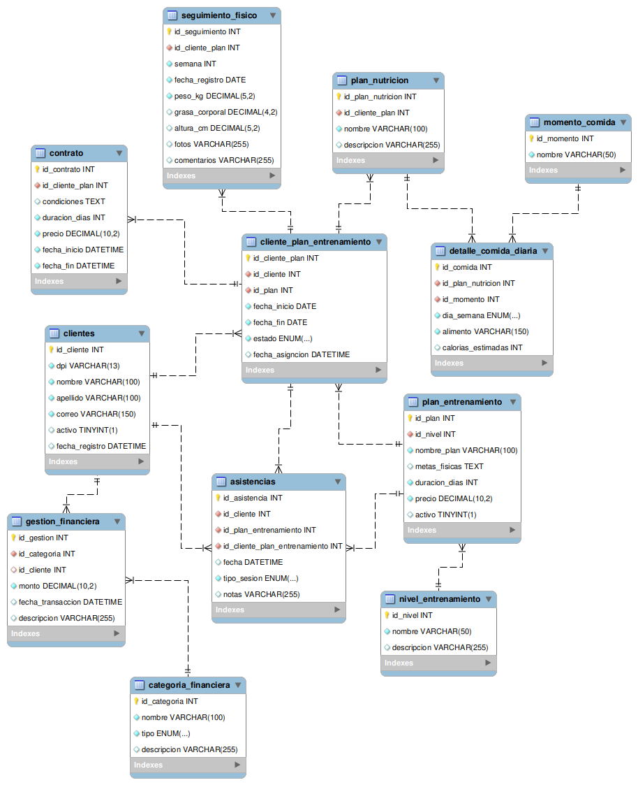

# HYDRA GYM - CLI

Aplicación interactiva de consola (CLI) desarrollada en **Node.js** y **MySQL** para la gestión integral y administración de datos de un gimnasio: control de clientes, planes de entrenamiento, contratos, planes nutricionales, seguimiento físico y finanzas.

---

## Tabla de Contenidos
1. [Descripción del Proyecto](#descripción-del-proyecto)
2. [Diagrama MER](#diagrama-mer)
3. [Estructura del Proyecto](#estructura-del-proyecto)
4. [Instrucciones de Instalación y Uso](#instrucciones-de-instalación-y-uso)
5. [Principios SOLID Aplicados](#principios-solid-aplicados)
6. [Patrones de Diseño Usados](#patrones-de-diseño-usados)
7. [Consideraciones Técnicas](#consideraciones-técnicas)
8. [Créditos, Creador y Objetivo](#créditos-creador-y-objetivo)

---

## Descripción del Proyecto

**Hydra Gym** es una solución por línea de comandos diseñada para centralizar las operaciones de un centro de entrenamiento deportivo. Permite gestionar todo el ciclo de vida del cliente dentro del gimnasio:

* **Gestión de Clientes:** Registro, consulta por ID o nombre, validación de documentos de identidad (DPI) y actualización de estados activos.
* **Planes de Entrenamiento:** Creación y categorización de programas físicos según nivel, duración y precio.
* **Membresías y Contratos:** Asignación de planes a clientes con cálculo automático de fechas de vigencia y registro contractual.
* **Seguimiento Físico:** Monitoreo semanal de composición corporal (peso, porcentaje de grasa, altura) y notas de evolución.
* **Nutrición Personalizada:** Creación de planes alimenticios y detalle de comidas diarias por momentos del día.
* **Gestión Financiera:** Registro de ingresos y egresos, categorización y reportes de balances netos.

---

## Diagrama MER



---

## Estructura del Proyecto

El proyecto sigue una arquitectura en capas desacoplada y orientada a objetos:

```text
hydra-gym/
├── database/
│   ├── diagrams/             # Diagramas ER y modelos visuales de la base de datos
│   └── script/
│       ├── schema.sql        # Creación de tablas, claves foráneas y relaciones
│       ├── insert.sql        # Datos iniciales y catálogos base
├── src/
│   ├── app.js                # Punto de entrada y orquestador del ciclo de vida CLI
│   ├── commands/             # Capa de presentación e interacción CLI (Enquirer + Chalk)
│   │   ├── categoriaFinancieraCmd.js
│   │   ├── clienteCmd.js
│   │   ├── clientePlanEntrenamientoCmd.js
│   │   ├── contratoCmd.js
│   │   ├── detalleComidaCmd.js
│   │   ├── gestionFinancieraCmd.js
│   │   ├── planEntrenamientoCmd.js
│   │   ├── planNutricionCmd.js
│   │   └── seguimientoFisicoCmd.js
│   ├── config/
│   │   └── database.js       # Conexión Singleton a la base de datos MySQL
│   ├── models/               # Clases por entidad y Factory Method
│   │   ├── categoriaFinanciera.js
│   │   ├── clientePlanEntrenamiento.js
│   │   ├── clientes.js
│   │   ├── contrato.js
│   │   ├── detalleComida.js
│   │   ├── entityFactory.js  # Factory Method centralizado
│   │   ├── gestionFinanciera.js
│   │   ├── planEntrenamiento.js
│   │   ├── planNutricion.js
│   │   └── seguimientoFisico.js
│   ├── services/             # Capa de persistencia y consultas SQL (Prepared Statements)
│   │   ├── categoriaFinancieraService.js
│   │   ├── clientePlanEntrenamientoService.js
│   │   ├── clienteService.js
│   │   ├── contratoService.js
│   │   ├── detalleComidaService.js
│   │   ├── gestionFinancieraService.js
│   │   ├── planEntrenamientoService.js
│   │   ├── planNutricionService.js
│   │   └── seguimientoFisicoService.js
│   └── utils/
│       └── menu.js           # Menús dinámicos, encabezados y pausas
├── .env.example              # Plantilla de variables de entorno
├── package.json              # Dependencias y scripts de Node.js
└── README.md                 # Documentación técnica general
```

---

## Instrucciones de Instalación y Uso

### Prerrequisitos
* **Node.js** (v18 o superior recomendado)
* **MySQL Server** (v8.0 o superior)

### 1. Clonar el repositorio
```bash
git clone https://github.com/Anderson-Oloroso/hydra-gym.git
cd hydra-gym
```

### 2. Instalar dependencias
```bash
npm install
```

### 3. Configurar la Base de Datos
Inicia sesión en tu servidor MySQL y ejecuta el script de creación:
```sql
source database/script/schema.sql;
source database/script/insert.sql;
```

### 4. Configurar variables de entorno
Crea un archivo `.env` en la raíz del proyecto tomando como referencia `.env.example`:

```env
DB_HOST=localhost
DB_PORT=3306
DB_USER=root
DB_PASSWORD=tu_password_mysql
DB_NAME=hydra_gym
```

### 5. Ejecutar la Aplicación
* **Modo desarrollo (con reinicio automático al guardar cambios):**
```bash
npm run dev
```

* **Modo producción / normal:**
```bash
npm start
```

---

## Principios SOLID Aplicados

| Principio | Implementación en Hydra Gym |
| :--- | :--- |
| **S - Single Responsibility Principle (SRP)** | Cada capa tiene una única razón para cambiar:<br>• `Models`: Solo almacenan atributos y validaciones de formato de datos.<br>• `Services`: Solo manejan consultas SQL y lógica de persistencia.<br>• `Commands`: Solo gestionan la interfaz en terminal con Enquirer y formateo de tablas.<br>• `Config`: Solo administra la conexión con MySQL. |
| **O - Open/Closed Principle (OCP)** | La arquitectura permite agregar nuevas entidades al sistema registrándolas en `EntityFactory.js` y agregando su comando/servicio correspondiente sin necesidad de modificar o alterar las entidades ya existentes. |
| **L - Liskov Substitution Principle (LSP)** | Los modelos y comandos mantienen interfaces y contratos homogéneos y predecibles (métodos estándar `list`, `create`, `update`, `delete`), evitando comportamientos inesperados. |
| **I - Interface Segregation Principle (ISP)** | Los servicios solo exponen métodos específicos a su dominio. Por ejemplo, `GestionFinancieraService` implementa consultas específicas como `getBalanceGeneral()` y `getBalancePorCategorias()`, mientras que servicios como `ContratoService` no se sobrecargan con operaciones innecesarias. |
| **D - Dependency Inversion Principle (DIP)** | Los comandos no crean conexiones directas a la base de datos; consumen la capa de servicios, y los servicios dependen del módulo centralizado `database.js`. |

---

## Patrones de Diseño Usados

### 1. Patrón Singleton
* **Ubicación:** [`src/config/database.js`](src/config/database.js)
* **Propósito:** Garantizar que exista **una única instancia activa de conexión/pool** a MySQL en toda la aplicación, evitando la creación descontrolada de sockets y asegurando un cierre limpio al salir del programa.

### 2. Patrón Factory Method
* **Ubicación:** [`src/models/entityFactory.js`](src/models/entityFactory.js)
* **Propósito:** Proveer una interfaz centralizada (`EntityFactory.create(entityType, data)`) para instanciar cualquier clase del sistema (`Cliente`, `PlanEntrenamiento`, `CategoriaFinanciera`, `Contrato`, etc.) a partir de un identificador textual y un objeto de datos, desacoplando los comandos de los constructores individuales.

### 3. Patrón Repository / Service
* **Ubicación:** [`src/services/`](src/services/)
* **Propósito:** Encapsular todas las sentencias SQL (`SELECT`, `INSERT`, `UPDATE`, `DELETE`, `JOIN`) en clases de servicio dedicadas, garantizando consultas preparadas parametrizadas para proteger la aplicación contra inyecciones SQL.

---

## Consideraciones Técnicas

* **Módulos ECMAScript (ESM):** Configurado con `"type": "module"` en `package.json`, utilizando sintaxis estándar `import` / `export`.
* **Seguridad SQL:** Uso estricto de Prepared Statements (`db.execute(query, [params])`) en todas las operaciones que reciben entradas de usuario.
* **Experiencia de Usuario en Terminal:**
  * **Enquirer:** Menús interactivos tipo lista seleccionable con teclado, formularios estructurados y cuadros de confirmación.
  * **Chalk:** Código de colores semántico (verde para éxitos, rojo para errores, amarillo para advertencias, cian para información).
  * **Console Table:** Renderizado de registros en formato de tabla con formateo amigable de fechas y moneda (`Q` Quetzales).
* **Gestión de Errores y Cierre Limpio:** Control de interrupciones (`SIGINT` / cancelación) asegurando la desconexión de MySQL mediante `closeConnection()`.

---

## Créditos, Creador y Objetivo

* **Creador:** [Anderson-Oloroso](https://github.com/Anderson-Oloroso)
* **Proyecto:** Hydra Gym CLI
* **Objetivo:** Desarrollar una solución integral, estructurada y profesional en Node.js y MySQL para la gestión operativa y financiera de un gimnasio, implementando buenas prácticas de arquitectura de software, principios SOLID y patrones de diseño creacionales.

* **Ultima modificación:** _05/10/2026_